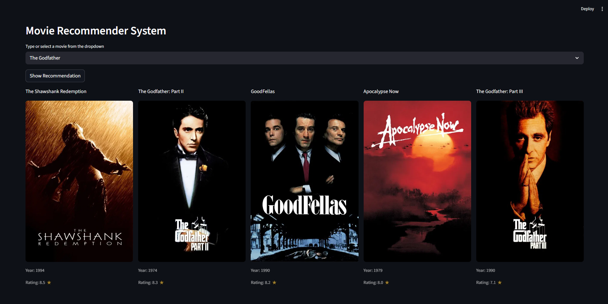
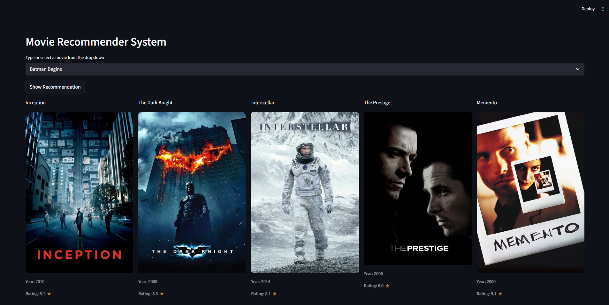
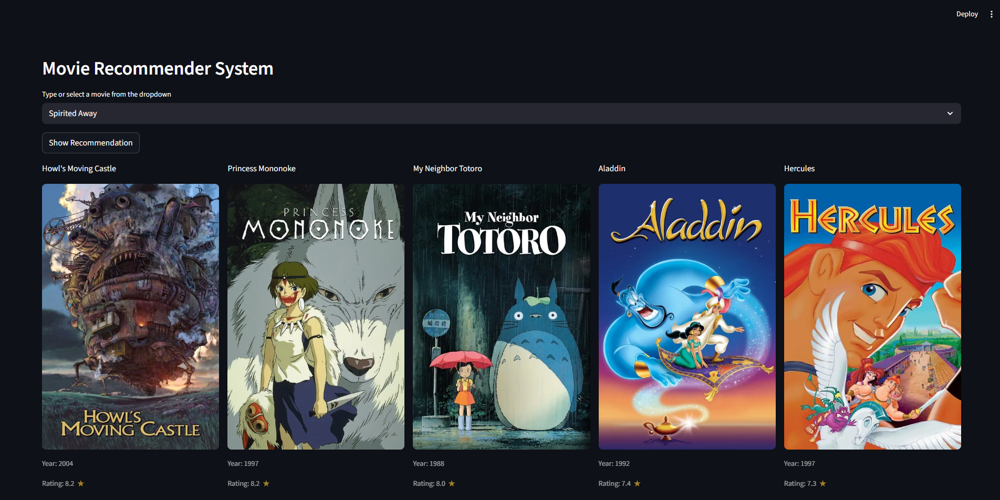
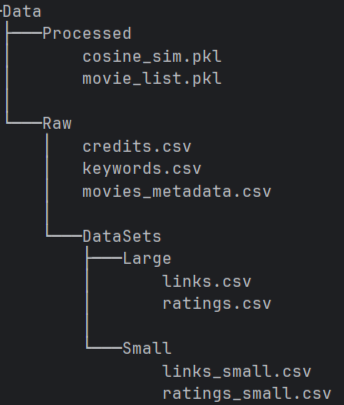

# Рекомендательная система фильмов

# Демонстрация работы:








# Данные:
### [Yandex Disk](https://disk.yandex.ru/client/disk/RecSys)
* credits.csv - актёрский состав и состав команды

* movies_metadata.csv - 24 признака для каждого фильма

* keywords.csv - список тегов 

### Маленький набор данных - 100 тысяч оценок от 700 пользователей для 9 тысяч фильмов

* links_small.csv - id на tmdb и imdb

* ratings_small.csv - оценки пользователей 

### Большой набор данных - 26 миллионов оценок от 270 тысяч пользователей для 45 тысяч фильмов

* links.csv - id на tmdb и imdb

* ratings.csv - оценки пользователей 

# Механизм работы:

1 . Предобработка данных:

* Загрузка, объединение данных, изменение типов
* Создание новых фич: год выпуска, режиссёр фильма
* Преобразование и фильтрация исходных фич
* Создание супер-фичи из объединения: ключевых слов + актёров + директора + жанра
* Вычисление косинусного сходства на основе этой фичи

2 . Вычисление топ 5 рекомендованных фильмов для показа:

* Пользователь вводит название фильма
* Функция вычисляет топ 25 фильмов на базе косинусного сходства
* Они фильтруются на основе внутренней формулы расчёта популярности на TMDB
* Выдаёт топ 5 фильмов для показа пользователю

# Как запустить

### Шаг 1 - [склонировать текущий репозиторий](https://github.com/IvanKirOfficial/Movie_RecSys)
### Шаг 2 - создать виртуальное окружение
```bash
python -m venv .venv 
```
### Шаг 3 - установить зависимости
```bash
pip install -r requirements.txt
```

### Шаг 4 - [скачать данные](https://disk.yandex.ru/client/disk/RecSys)
### Шаг 5 - распаковать данные 



### Шаг 6 - запустить веб-клиент

```bash
streamlit run Service/app.py
```
